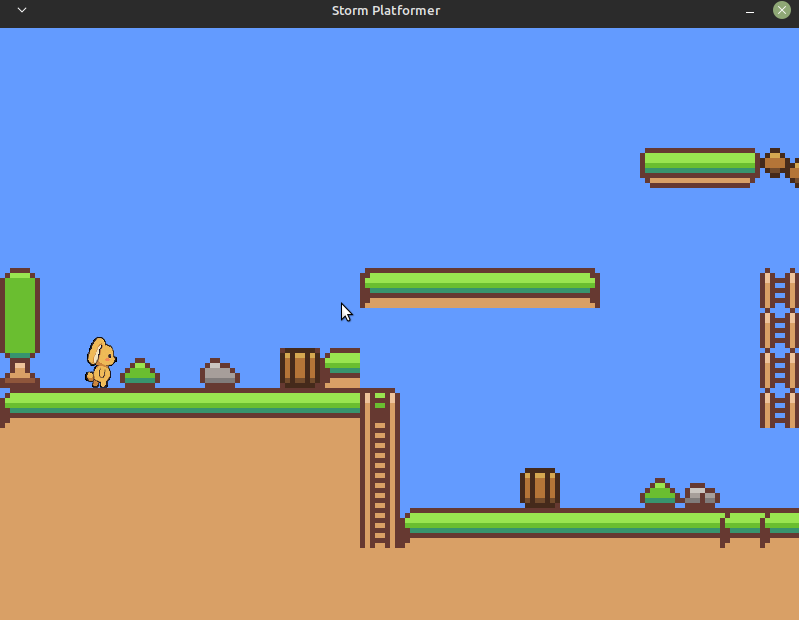

# Storm! Engine v2

A lightweight, ECS-based 2D game engine built on SDL2 — made for game jams and personal projects.

> **"v2" is the second-generation engine; the current release is v1.2.0.** The public API is considered stable for the 1.x line. See [CHANGELOG.md](CHANGELOG.md) for release notes.



## Features

- **Entity-Component-System (ECS)** architecture
- **Sprite rendering** with camera, z-index sorting, and flip support
- **Tilemap support** — load maps painted with the built-in tile editor (`.map` format, auto-detected)
- **Box collider** components with debug overlay
- **Asset store** for textures
- **Game state machine** for managing scenes
- **Logger** utility
- **Virtual gamepad** for touch devices — d-pad + action-button layout, pure and spec'd (`<stormengine2/input/virtualGamepad.h>`)
- **UDP networking** — host/join LAN play: reliable + unreliable chunks, kick/ban/timeout, snapshot replication with per-client deltas and a prediction cache (`<stormengine2/net/net.h>`, see [docs/networking.md](docs/networking.md))
- Built-in **tile map editor** with drag-to-paint, drag-to-erase, and layer support
- Example games: platformer, shooter, strategy, puzzle, JRPG, sports, Android platformer
- Platforms: Linux, Nintendo Switch (source builds), Android (source builds, verified on hardware); iOS possible via the same SDL layer

## Installation

Pre-built `.deb` packages are available on the [Releases](https://github.com/WillSams/storm-engine-v2/releases) page.

### Debian / Ubuntu / Linux Mint (amd64)

```bash
sudo dpkg -i libstormenginev2_<version>_amd64.deb
```

#### Raspberry Pi 4/5 with 64-bit OS (arm64)

```bash
sudo dpkg -i libstormenginev2_<version>_arm64.deb
```

After installing, link your project with `-lstormenginev2`.

## Building from Source

### Prerequisites

Install SDL2 and its extensions, plus a few other dependencies:

```bash
sudo apt update && sudo apt install -y \
    libsdl2-dev libsdl2-image-dev libsdl2-ttf-dev libsdl2-mixer-dev \
    libglm-dev libtinyxml2-dev liblua5.4-dev libgtk-3-dev \
    valgrind
```

Install [Igloo](https://github.com/codewars/igloo) (test framework):

```bash
git clone https://github.com/codewars/igloo.git
cd igloo
git submodule add -b headers-only https://github.com/banditcpp/snowhouse snowhouse
git submodule update --init --recursive
mkdir build && cd build
cmake ..
sudo cmake --build . --target install
```

### Build & install the library

```bash
make -f Makefile.debian
sudo make -f Makefile.debian install
```

### Run the tests

```bash
make -f Makefile.debian test
```

## Running the Examples

```bash
cd examples/platformer
make && make run
```

Swap `platformer` for `shooter`, `strategy`, `puzzle`, `jrpg`, `sports`, or `checkers` to try the others. `checkers` is a graphical 2-player game: the host validates every move over the net module and the first two joiners are seated RED and BLACK (`host` starts it with `S`).

Two examples are headless console demos of the networking module — no graphics, run from a terminal. `cd examples/netchat && make && ./bin/netchat host` opens a room; `./bin/netchat join 127.0.0.1 5000` joins it from another terminal. `examples/netrepl` is the same shape (`host` / `join`) and streams snapshot deltas. See each example's README for usage.

### How each example loads its world

Each example demonstrates a different approach to managing game resources — pick whichever matches your project's needs:

#### Platformer / Strategy — tile editor + `.map` file

The level is painted in the built-in tile editor and saved as a `.map` file. At runtime, `TileMapLoader` reads the file and spawns tile entities automatically. This is the most data-driven approach for tilemap games and the best starting point if you want to design levels visually.

```text
editor/ → paint level → saves level.map
examples/platformer/ → TileMapLoader reads level.map at runtime
```

#### Sports / Puzzle — everything in code

No external level files. Entities, positions, sizes, and game rules are all defined directly in the game state. Simple and self-contained — a good starting point for understanding the ECS pipeline without any file I/O in the way.

#### Shooter — XML data via `XmlLoader`

Textures and initial entities are described in an XML file (`assets/attack.xml`). The engine's `XmlLoader` parses the file, and `LoadTexturesFromXml` (a helper in `<stormengine2/xmlLoader.h>`) loads them into the asset store. Entity spawning logic then reads the parsed data and creates ECS entities from it.

```text
assets/attack.xml → XmlLoader → LoadTexturesFromXml → AssetStore
                              → XmlObjectDef list → ECS entities
```

This approach keeps your texture IDs and initial object placement out of code and in data files — useful when designers or tools are generating the XML.

#### JRPG — tile editor `.map` + custom colliders map

The world is painted in the tile editor (`jrpg.map`). A second file, `jrpg_colliders.map`, lists solid tiles using a simple `collider worldX worldY ...` format. At runtime, `TileMapLoader` spawns tile entities (using `tileSize=8` to preserve exact editor pixel coordinates), and a custom parser reads the colliders file into a list of `SDL_Rect` obstacles used for AABB collision.

```text
editor/ → paint level → jrpg.map + jrpg_colliders.map
examples/jrpg/ → TileMapLoader reads jrpg.map
              → custom parser reads jrpg_colliders.map → SDL_Rect list
```

NPC interaction and Final Fantasy-style typewriter dialogue are handled via `NpcComponent` and `DialogueState` — no external scripting required.

| Example | Resource approach | Key engine type |
|---|---|---|
| **Platformer** | `.map` file from the tile editor | `TileMapLoader` |
| **Strategy** | `.map` file from the tile editor | `TileMapLoader` |
| **Sports** | Hard-coded in the game state | — |
| **Puzzle** | Hard-coded in the game state | — |
| **Shooter** | XML file via tinyxml2 | `XmlLoader`, `LoadTexturesFromXml` |
| **JRPG** | `.map` + custom colliders map | `TileMapLoader`, custom parser |
| **Netchat** | Console demo — none | `NetServer`, `NetClient`, `NetMessageWriter` |
| **Netrepl** | Console demo — none | `NetSnapshot`, `NetSnapshotDelta` |
| **Checkers** | Hard-coded in the game state | `NetServer`, `NetClient`, `NetMessageWriter`, `RenderSystem` |

## Using the Tile Editor

```bash
cd editor
make && make run
```

- **Left-click / drag** — paint tiles
- **Right-click / drag** — erase tiles
- **D** — toggle collider debug overlay
- The editor saves `.map` files that `TileMapLoader` can load directly in your game

## Windows / WSL

The Makefile should work under WSL2 with the same `apt` prerequisites above. Native Windows builds are not officially supported yet — PRs welcome.

## Nintendo Switch

Switch builds use [devkitPro](https://devkitpro.org/) and produce a `.nro` homebrew file.

### Prerequisites

Install devkitPro with the Switch portlibs:

```bash
# Follow the devkitPro pacman setup at https://devkitpro.org/wiki/Getting_Started
sudo dkp-pacman -S switch-dev switch-sdl2 switch-sdl2_image switch-sdl2_ttf switch-sdl2_mixer switch-tinyxml2
```

### Build

```bash
export DEVKITPRO=/opt/devkitpro
export PATH=$DEVKITPRO/devkitA64/bin:$DEVKITPRO/tools/bin:$PATH

cd examples/nx-platformer
make
```

This produces a `.nro` you can run on a homebrew-enabled Switch. To launch in an emulator, use [Suyu](https://git.suyu.dev/suyu/suyu/releases) (the recommended Yuzu successor on Linux). Make sure to set the graphics backend to **OpenGL** in Suyu's settings before running:

```bash
make run EMULATOR=/path/to/Suyu.AppImage
```

Copy the `.nro` to `switch/` on your SD card to run on real hardware via the Homebrew Menu.

### Using Storm Engine in your own Switch project

There are no pre-built Switch packages — the engine is compiled directly into your game. Use `examples/nx-platformer` as your starting point:

1. Copy `examples/nx-platformer` to your new project
2. The `include/stormengine2` symlink points to `common/` — keep it or copy the sources in directly
3. Add your own game states, components, and assets under `src/` and `romfs/`
4. Build with `make` as above

## Android

Android builds compile the engine and your game into a single JNI library via
Gradle + CMake + NDK, hosted by SDL's `SDLActivity`. Verified on real hardware
(arm64) over USB debugging.

### Prerequisites

- Java 17, Android cmdline-tools, NDK, and CMake — full install commands in
  [`examples/android-platformer/README.md`](examples/android-platformer/README.md)
- The pinned dependency submodules:

```bash
git submodule update --init --recursive vendor/android   # SDL2, SDL_image, SDL_ttf, SDL_mixer, tinyxml2, glm
```

### Build

```bash
cd examples/android-platformer
./gradlew assembleDebug      # app/build/outputs/apk/debug/app-debug.apk
./gradlew installDebug       # install onto a USB-debugging device
adb shell am start -n com.stormengine.platformer/.PlatformerActivity
```

The example adds on-screen touch pads (pure, spec'd zone logic) on top of the
desktop platformer, letterboxes a fixed logical resolution onto any screen, and
extracts APK assets to internal storage at first launch so the engine's
plain-file I/O works unchanged. See the example README for the build gotchas
(shared vs. static SDL, the `SDL2/SDL_image.h` include shim, adb multi-device).

### Using Storm Engine in your own Android project

Like the Switch, there are no pre-built Android packages — the engine compiles
into your app. Use `examples/android-platformer` as your starting point:

1. Copy `examples/android-platformer` to your new project
2. The `include/stormengine2` symlink points to `common/` — keep it or copy the sources in
3. Change the `applicationId`/package name, add your states under `src/`, point
   the `assets.srcDirs` at your asset folder
4. Build with `./gradlew` as above

## License

Released under the [WTFPL](LICENSE.md) — do what you want with it.

## Credits

Inspired by the [SDL Game Development](https://www.packtpub.com/en-us/product/sdl-game-development-9781849696838) book by Shaun Mitchell and Gustavo Pezzi's [C++ Game Engine Programming course](https://pikuma.com/courses/cpp-2d-game-engine-development).

[SDL2](https://wiki.libsdl.org/SDL2/Installation) · [GLM](https://github.com/g-truc/glm) · [Igloo](https://github.com/codewars/igloo) · [TinyXML2](https://github.com/leethomason/tinyxml2) · [ImGui](https://github.com/ocornut/imgui) · [Lua](https://www.lua.org/)
