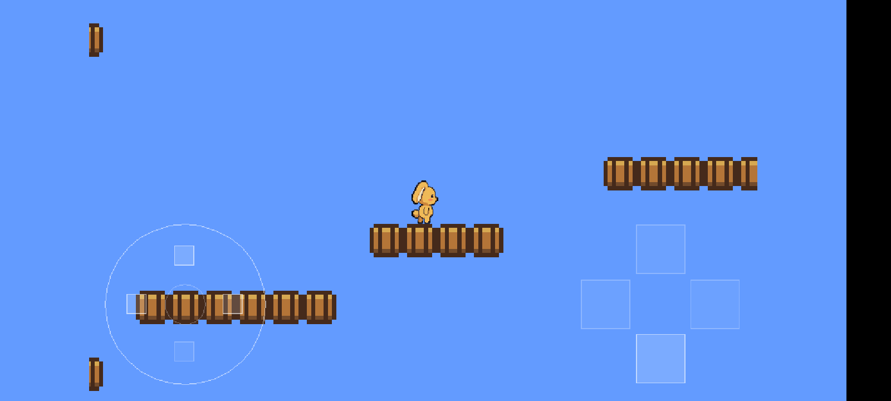

# Android Platformer

The desktop platformer example built as an Android app: the engine and game compile into a single JNI library via the NDK, SDL's `SDLActivity` hosts it, and the engine's virtual gamepad replaces the keyboard. Bluetooth keyboards still work. Assets are extracted from the APK to internal storage on first launch so the engine's plain-file I/O works unchanged.

Verified working on real hardware (arm64) over USB debugging.



## Controls

The on-screen layout comes from `<stormengine2/input/virtualGamepad.h>` - a circular 8-way d-pad bottom-left and an Xbox-lettered action diamond
bottom-right:

```text
     (↑)                        (Y)
  (←) ● (→)               (X)        (B)
     (↓)                        (A)
```

Pass `VPadStyle::Snes` to `MakeVPadLayout` for the SNES lettering (X top, Y left, A right, B bottom) instead. The four touch targets are in the same places either way - only which letter sits where changes.

| Control | Action |
|---------|--------|
| d-pad ◀ ▶ | move |
| d-pad ▲ / **A** | jump |
| d-pad ▼, **B**, **X**, **Y** | unbound - drawn dimmed |
| arrows / `A` `D` | move (hardware keyboard) |
| space / ▲ / `W` | jump (hardware keyboard) |
| Esc / Back | quit |

Touches are converted to the game's logical coordinate space with
`SDL_RenderWindowToLogical`. That matters because `finger->x`/`y` are normalised over the *whole* drawable including letterbox bars, and the logical resolution is a fixed 800×480 (5:3) letterboxed onto a display that is usually wider - scaling by the logical width directly squashes every touch toward the centre, so the controls respond somewhere other than where they are drawn.

## Orientation

The app follows the phone in all four orientations, **including when the
system auto-rotate toggle is off**.  

`android:screenOrientation` in the manifest does not decide this on its own. SDL calls SDLActivity.setOrientationBis()` from native code as the window is created and overwrites whatever the  manifest asked for. For a resizable window with no `SDL_HINT_ORIENTATIONS` set, SDL picks `SCREEN_ORIENTATION_FULL_USER` - which honours the phone's auto-rotate lock, so on a device with auto-rotate off the app is pinned to the user's preferred orientation and never turns. Setting the hint does not help either: that same code path still resolves a resizable window allowing both orientations to `FULL_USER`.

So `PlatformerActivity` overrides `setOrientationBis()` and requests `SCREEN_ORIENTATION_FULL_SENSOR` directly, which ignores the lock. Verify with:

```bash
adb logcat | grep setOrientation      # requestedOrientation=10 is FULL_SENSOR
adb shell dumpsys activity activities | grep -i screen_orientation
```

`configChanges` already lists `orientation|screenSize`, so the Activity is not recreated on a flip - SDL just sees a new drawable size.

Orientation is per game: it lives in each game's own Activity (and manifest), not in the engine. A game that should stay landscape simply does not override `setOrientationBis` and sets `screenOrientation` in its own manifest.

In portrait the fixed 800×480 logical size letterboxes into a band across the middle of the screen. The game is fully playable, but it is small, and the d-pad and buttons sit inside that band rather than at the physical screen edges - they are positioned in logical space. Making portrait feel native would need a responsive logical size or a separate portrait layout.

## One-time setup

1. **Submodules** (SDL2 2.30.11, SDL_image 2.8.8, SDL_ttf 2.22.0, SDL_mixer 2.8.1, tinyxml2 10.0.0, glm 1.0.1 - `--recursive` pulls SDL_ttf's vendored FreeType):

   ```bash
   git submodule update --init --recursive vendor/android
   ```

2. **Android SDK + NDK** (no Android Studio needed). With Java 17 installed:

   ```bash
   mkdir -p ~/Android/Sdk/cmdline-tools && cd ~/Android/Sdk/cmdline-tools
   curl -LO https://dl.google.com/android/repository/commandlinetools-linux-11076708_latest.zip
   unzip commandlinetools-linux-*.zip && mv cmdline-tools latest

   export ANDROID_HOME=~/Android/Sdk
   export PATH=$ANDROID_HOME/cmdline-tools/latest/bin:$ANDROID_HOME/platform-tools:$PATH

   sdkmanager --licenses
   sdkmanager "platform-tools" "platforms;android-34" "build-tools;34.0.0" \
              "ndk;26.1.10909125" "cmake;3.22.1"
   ```

   Add `ANDROID_HOME` and the `PATH` entries to your shell profile.

3. **Gradle wrapper** (first time only, from this directory):

   ```bash
   gradle wrapper --gradle-version 8.7
   ```

## Build, install, run

Enable **USB debugging** on the phone (Developer options), plug it in, and:

```bash
cd examples/android-platformer
gradle clean                # if necessary to clear stale build artifacts
./gradlew assembleDebug     # builds app/build/outputs/apk/debug/app-debug.apk
./gradlew installDebug      # installs onto the connected device

adb shell am start -n com.stormengine.platformer/.PlatformerActivity
adb logcat | grep -iE "SDL|platformer|AndroidRuntime|FATAL"   # watch for errors
```

Or just tap **Storm Platformer** in the app drawer - `installDebug` installs but does not launch.

### Gotchas we hit so you don't have to

- **`error: more than one device/emulator`** - a stale Wi-Fi debugging connection alongside USB. `adb disconnect` drops the TCP endpoints, or target the phone with `adb -s <serial> ...`.
- **`dlopen failed: library "libSDL2.so" not found`** - SDL2/SDL_image must build as *shared* libraries; `SDLActivity` loads them by name at startup (see `getLibraries()` in `PlatformerActivity`). The CMakeLists pins `SDL_SHARED ON` before `add_subdirectory` and only flips `BUILD_SHARED_LIBS OFF` for tinyxml2, which links statically into `libmain.so`.
- **`fatal error: 'SDL2/SDL_image.h' file not found`** - SDL_image's source tree ships `include/SDL_image.h` without the `SDL2/` prefix (distros add it at install time). The CMakeLists stages a compat copy into `<builddir>/compat/SDL2/` so the engine's desktop include path works unchanged.

## Layout

```text
app/jni/CMakeLists.txt   Builds vendored SDL2/SDL_image (shared) + tinyxml2 (static) + engine common/ + game src/ into libmain.so
app/build.gradle         CMake wiring (targets 'main'), SDL Java shim from the submodule, assets reused from ../platformer
app/src/main/java/...    PlatformerActivity - extracts APK assets to internal storage, then SDLActivity loads SDL2, SDL2_image, main
src/                     Game code (shares playerComponent.h with the desktop example)
include/stormengine2     Symlink to ../../common so engine includes resolve without an installed lib
```

The native side `chdir()`s to `SDL_AndroidGetInternalStoragePath()` at boot, so
all `./assets/...` paths behave exactly like the desktop build.
