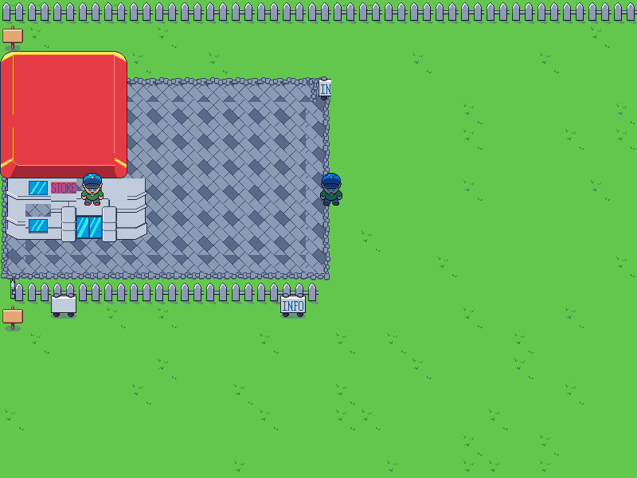

# Storm JRPG

A top-down RPG built as a storm-engine-v2 example. Demonstrates tile-based world loading, NPC interaction, and Final Fantasy-style typewriter dialogue - all without modifying the engine.



## Building & Running

From the `examples/jrpg/` directory:

```bash
make        # build
make run    # launch
```

The binary is written to `bin/jrpg`.

**Run it from this directory.** Every asset path is relative to the working
directory, so launching the binary from anywhere else finds nothing. A missing
tileset, map or font is now fatal and names the file it could not open; the
process exits non-zero rather than opening an empty window.

## How to Play

| Input | Action |
|---|---|
| `↑` / `W` | Move up |
| `↓` / `S` | Move down |
| `←` / `A` | Move left |
| `→` / `D` | Move right |
| `E` / `Space` / `Enter` | Interact with NPC / advance dialogue |
| `F1` | Toggle collision debug overlay |
| `ESC` | Quit |

Walk up to an NPC and press `E` to start a conversation. Press `E` again while the typewriter is running to skip ahead to the full text; press it once more to close the box.

## Engine Concepts Demonstrated

### TileMapLoader with `tileSize=8`

The world is painted in the built-in tile editor (`jrpg.map`, canvas 1248×640). The editor stores tile positions in its own coordinate space. Passing `tileSize=8` to `TileMapLoader` recovers the exact editor pixel positions from `relativePosition`:

```cpp
TileMapLoader loader("./assets/tilemaps/jrpg.map", "", LOADER_TILE_SIZE); // 8

for (const auto &tile : loader.getMap()) {
    float wx = tile.relativePosition.x * LOADER_CELL_PX; // * 8 = exact pixel X
    float wy = tile.relativePosition.y * LOADER_CELL_PX;
    // ...
}
```

> **Why 8?** `tileSize` has to divide every world coordinate in the map exactly,
> or `relativePosition` truncates and the tile lands somewhere else. The map was
> originally painted on an 8px grid, which is where the 8 comes from.
>
> It is now on a 16px grid - `assets/tilemaps/retile.py` re-laid the ground,
> the paving and the roof on whole tiles - so 16 would divide it too. 8 still
> divides it and costs nothing, so the loader is unchanged; the point of the
> number is that it must divide the grid, not that it must equal it.

Source tiles are 32×32 px from two tileset PNGs (`Buildings-Tileset.png`, `Outside-Tileset.png`).

### Custom Colliders Map

Solid tiles are listed in `jrpg_colliders.map` in a simple space-separated format:

```
collider worldX worldY scaleX scaleY colW colH offX offY
```

`LoadColliders()` parses this at startup into a `std::vector<SDL_Rect>`. `colW`/`colH` give the rect's size, and **0 means one source tile** (32×32) - which is what most hand-placed entries use. Sized entries are what let one line cover a whole building or a whole fence run instead of spelling it out a block at a time; of the 19 entries shipped, 6 are larger than a tile. Collision is tested in `CollidesWithLevel()` using a small "feet box" at the bottom of the player sprite - this keeps the player sprite visually above obstacles rather than stopping at their centre.

```cpp
// Feet box - lower 16px, inset 4px on each side
SDL_Rect feetBox = { x + 4, y + PLAYER_FRAME_H - 16, PLAYER_FRAME_W - 8, 16 };

// Separate X / Y passes - allows wall sliding
SDL_Rect testX = { feetBox.x + vx * dt, feetBox.y, feetBox.w, feetBox.h };
if (!CollidesWithLevel(testX)) transform.position.x += vx * dt;

SDL_Rect testY = { feetBox.x, feetBox.y + vy * dt, feetBox.w, feetBox.h };
if (!CollidesWithLevel(testY)) transform.position.y += vy * dt;
```

Separate X and Y passes mean the player can slide along a wall rather than stopping dead.

### Sprite Sheet Layout

Both the player and NPCs share the same sprite sheet (`NPC-Sprite-Sheet.png`, 640×64 px, 20 frames of 32×64 each):

| Frames | Direction | State |
|---|---|---|
| 0 | Up | Idle |
| 1 | Down | Idle |
| 2 | Left | Idle |
| 3 | Right | Idle |
| 4–7 | Up | Walk |
| 8–11 | Down | Walk |
| 12–15 | Left | Walk |
| 16–19 | Right | Walk |

`PlayerSrcX()` maps `PlayerComponent::facing` + `isMoving` + `walkFrame` to the correct `srcRect.x` each frame. NPCs get a blue `SDL_SetTextureColorMod` tint applied per draw call to distinguish them from the player without requiring a separate texture.

### PlayerComponent

```cpp
enum class Direction { Up, Down, Left, Right };

struct PlayerComponent {
    float     moveSpeed   = 120.0f;
    Direction facing      = Direction::Down;
    bool      isMoving    = false;
    int       walkFrame   = 0;
    float     animTimer   = 0.0f;
    float     animInterval = 0.15f; // seconds per walk frame
};
```

### NPC Interaction

`NpcComponent` stores the NPC's name, dialogue string, facing direction, and interaction radius. Each frame, `CheckNpcInteraction()` measures the Euclidean distance between the player's centre and each NPC's centre. If the player presses `E` within `interactDist` (48 px by default), a `DialogueState` is populated and movement is suspended until the dialogue is closed.

### Dialogue System

`DialogueState` drives a Final Fantasy-style typewriter box rendered at the bottom of the screen:

```cpp
struct DialogueState {
    bool        active;
    std::string speakerName;
    std::string fullText;
    int         visibleChars;   // increases each typeInterval seconds
    float       typeTimer;
    float       typeInterval = 0.04f; // ~25 chars/sec
    bool        complete;
};
```

`UpdateDialogue()` increments `visibleChars` each `typeInterval` seconds. The first confirm press skips to the full text; the second closes the box. `RenderDialogueBox()` draws a semi-transparent background, the speaker name in gold, and the visible substring of the dialogue in white.

### Camera

A `glm::vec2 camera_` follows the player's centre each frame, clamped to the level bounds so the camera never shows empty space:

```cpp
camera_.x = std::max(0.f, std::min(playerCX - windowWidth_  / 2.f, LEVEL_W - windowWidth_));
camera_.y = std::max(0.f, std::min(playerCY - windowHeight_ / 2.f, LEVEL_H - windowHeight_));
```

`RenderWorld()` bypasses the built-in `RenderSystem` for drawing, iterating `GetSystemEntities()` directly, subtracting `camera_` from each destination rect, and culling off-screen entities.

## Project Structure

```text
jrpg/
├── Makefile
├── README.md
├── assets/
│   ├── README.md                       ← artwork credit and licence
│   ├── fonts/
│   │   └── font.ttf
│   ├── gfx/
│   │   ├── Buildings-Tileset.png       ← 32×32 tile sheet (endesga-32 palette)
│   │   ├── Outside-Tileset.png         ← 32×32 tile sheet (roads, grass, fences, signs)
│   │   ├── NPC-Sprite-Sheet.png        ← 640×64, 20 frames of 32×64 each
│   │   └── icon.png                    ← window icon, cut from the sheet above
│   └── tilemaps/
│       ├── jrpg.map                    ← editor tile map (1248×640 canvas), generated
│       ├── jrpg_colliders.map          ← solid list (worldX/worldY/colW/colH per entry)
│       └── retile.py                   ← regenerates jrpg.map; do not hand-edit the map
└── src/
    ├── main.cpp
    ├── game.h / game.cpp
    ├── components/
    │   ├── playerComponent.h
    │   └── npcComponent.h
    └── states/
        ├── playState.h
        └── playState.cpp
```
