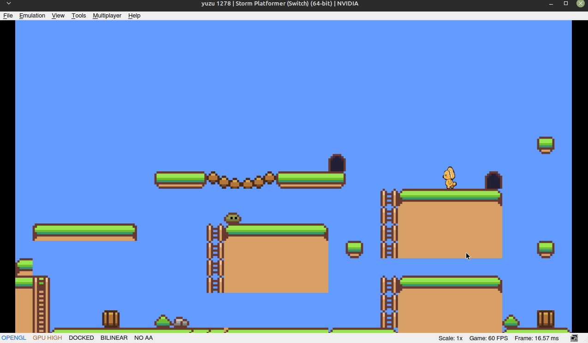

# Storm Platformer - Nintendo Switch

A Nintendo Switch homebrew port of the storm-engine-v2 platformer example. Builds with [devkitPro](https://devkitpro.org/) and produces an `.nro` you can run on a homebrew-enabled Switch or in an emulator.



## Prerequisites

Install devkitPro with the Switch portlibs:

```bash
# Follow devkitPro setup at https://devkitpro.org/wiki/Getting_Started
sudo /opt/devkitpro/pacman/bin/pacman -S switch-dev switch-sdl2 \
  switch-sdl2_image switch-sdl2_ttf switch-sdl2_mixer switch-tinyxml2
```

## Building

```bash
export DEVKITPRO=/opt/devkitpro
export PATH=$DEVKITPRO/devkitA64/bin:$DEVKITPRO/tools/bin:$PATH

make
```

Output: `bin/nx-platformer.nro` (the Makefile's `BUILD` directory is `bin`)

## Running

**In an emulator:**

[Suyu](https://git.suyu.dev/suyu/suyu/releases) is the recommended emulator (Yuzu successor). Download the AppImage, then:

```bash
make run EMULATOR=/path/to/Suyu.AppImage
```

> **Important:** In Suyu, go to **Emulation → Configure → Graphics** and set the API to **OpenGL** before running. Vulkan may fail depending on your GPU driver version.

**On hardware (homebrew-enabled Switch):**

Copy `bin/nx-platformer.nro` to `switch/` on your SD card and launch it from the Homebrew Menu.

## Controls

| Button | Action |
|---|---|
| Left stick / D-pad ← | Move left |
| Left stick / D-pad → | Move right |
| A / D-pad ↑ / Left stick ↑ | Jump |
| + (Plus) | Quit |

## How It Differs from the Linux Example

| | Linux (`examples/platformer`) | Switch (`examples/nx-platformer`) |
|---|---|---|
| Window | 800×600, windowed | 1280×720, fullscreen |
| Input | SDL keyboard events | libnx `PadState` / `HidNpadButton_*` |
| Assets | `./assets/` (relative path) | `romfs:/assets/` (embedded romfs) |
| Engine | Links `-lstormenginev2` (.so) | Compiles `common/` sources directly (no shared lib on NX) |
| Solid tiles | Only tiles the map flags with a collider | Every painted tile (`SpawnTiles()` has no `hasCollider` check) |
| Build system | `examples.mk` (shared) | devkitPro `switch_rules` |

## Assets

Assets live in `romfs/` and are embedded into the `.nro` at build time via the `ROMFS` variable in the Makefile. On hardware they're accessed via `romfs:/assets/...`; the `ASSET_ROOT` constant in `playState.h` switches automatically based on `__SWITCH__`.

## Project Structure

```text
nx-platformer/
├── Makefile
├── README.md
├── screenshot.png
├── bin/                                     ← build output: nx-platformer.nro and friends
├── include/stormengine2 -> ../../../common  ← symlink: engine sources + <stormengine2/...> includes
├── romfs/
│   └── assets/                              ← copies of examples/platformer/assets/
│       ├── gfx/
│       │   └── rabbit.png                   ← the player strip the game loads
│       └── tilemaps/
│           ├── 16x16-platformer.png
│           └── platformer.map
└── src/
    ├── main.cpp
    ├── game.h / game.cpp
    ├── components/
    │   └── playerComponent.h
    └── states/
        ├── playState.h
        └── playState.cpp
```

## Engine Concepts Demonstrated

Same ECS architecture, `TileMapLoader`, tile-based physics, and scrolling camera as the Linux platformer - see `examples/platformer/README.md` for a detailed breakdown. The key Switch-specific addition is the `#ifdef __SWITCH__` blocks that swap keyboard input for controller input and `./assets/` paths for `romfs:/assets/` paths without duplicating any game logic.
