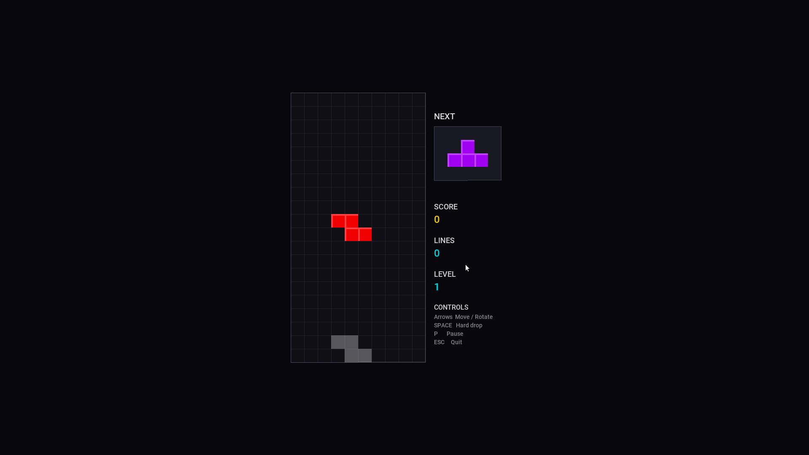

# Storm Tetris

A Tetris-style puzzle game built as a storm-engine-v2 example. Demonstrates custom ECS components and systems, entity reuse, deferred entity lifecycle, and text drawn from the engine's cached fonts - all wired together through the engine's Registry.



## Building & Running

From the `examples/puzzle/` directory:

```bash
make        # build
make run    # launch
```

The binary is written to `bin/tetris`.

## How to Play

| Input | Action |
|---|---|
| `←` / `→` | Move piece left / right |
| `↑` | Rotate piece clockwise |
| `↓` | Soft drop (move down one row, +1 score) |
| `Space` | Hard drop (instantly fall, +2 per row) |
| `P` | Pause / unpause |
| `ESC` | Quit |

Left/right movement supports **delayed auto-shift (DAS)** - hold the key and the piece starts repeating after a short initial delay.

### Scoring

| Action | Points |
|---|---|
| Soft drop | 1 per row |
| Hard drop | 2 per row |
| 1 line clear | 100 × level |
| 2 line clear | 300 × level |
| 3 line clear | 500 × level |
| 4 line clear (Tetris) | 800 × level |

Level increases by 1 every 10 lines. Drop speed increases with level, capping at 50 ms per row.

## Engine Concepts Demonstrated

### Custom Component

**`TetrisCellComponent`** (`src/components/tetrisCell.h`) stores a cell's logical position on the board (`boardRow`, `boardCol`), its color type (1–7 matching tetromino type), and whether it belongs to the active falling piece or a locked row.

### Custom System

**`TetrisSyncSystem`** (`src/systems/tetrisSystem.h`) requires `TetrisCellComponent` and `TransformComponent`. After every move, rotation, lock, or line clear it translates each cell's logical board coordinates into pixel screen coordinates:

```cpp
transform.position = { boardOffX + col * CELL, boardOffY + row * CELL }
```

This keeps the ECS data (board position) cleanly separated from the rendering data (pixel position), and means the engine's `RenderSystem` needs no changes.

### Engine Systems Used

- **`RenderSystem`** - draws all entities with `TransformComponent` + `SpriteComponent`, sorted by z-index (ghost pieces at 1 → locked/active blocks at 2)

### Cached Fonts and Text

`onEnter()` opens the HUD font into the `AssetStore` once per point size (`AddFont`), and `RenderText` is a one-line wrapper over the engine's `Text::Draw`, which is handed the cached `TTF_Font *` from `GetFont`. The earlier version re-opened the font from disk on every one of its call sites, every frame.

Teardown order matters: the destructor calls `assetStore_->ClearAssets()` **before** `TTF_Quit()`. `ClearAssets()` now closes fonts as well as destroying textures, and the other order would have it close fonts that `TTF_Quit()` has already freed.

### Frame Pacing

`update()` opens with the engine's `GameState::CapFrameRate()`, which sleeps out the rest of the ~16 ms budget and rolls `millisecondsPreviousFrame` forward. This state ignores the delta it returns and wants only the pacing.

### Entity Lifecycle Patterns

Two important patterns are shown:

**Entity reuse on lock** - when a piece locks, its 4 active entities are not destroyed. Their `TetrisCellComponent.isActive` flag is cleared and they become permanent locked-cell entities. Only the 4 ghost entities are killed.

**Deferred destroy on line clear** - when a full row is detected, matching locked-cell entities are killed via `entity.Kill()`. The registry does not remove them immediately; `registry_.Update()` is called at the end of `update()` to flush all pending creations and destructions before the next `TetrisSyncSystem::Update()` runs.

### State Machine

The game uses `GameStateMachine` with a single `PlayState`. Input events are polled exclusively inside `PlayState::processInput()` - the `Game` loop passes straight through - so SDL events are never consumed before the active state can see them.

## Project Structure

```text
puzzle/
├── Makefile
├── README.md
├── assets/
│   ├── fonts/
│   │   └── font.ttf
│   └── gfx/
│       ├── block_I.png     ← cyan   I-piece  (32×32)
│       ├── block_O.png     ← yellow O-piece  (32×32)
│       ├── block_T.png     ← purple T-piece  (32×32)
│       ├── block_S.png     ← green  S-piece  (32×32)
│       ├── block_Z.png     ← red    Z-piece  (32×32)
│       ├── block_J.png     ← blue   J-piece  (32×32)
│       ├── block_L.png     ← orange L-piece  (32×32)
│       └── block_ghost.png ← translucent ghost block (32×32)
└── src/
    ├── main.cpp
    ├── game.h / game.cpp
    ├── components/
    │   └── tetrisCell.h
    ├── systems/
    │   └── tetrisSystem.h
    └── states/
        ├── playState.h
        └── playState.cpp
```
