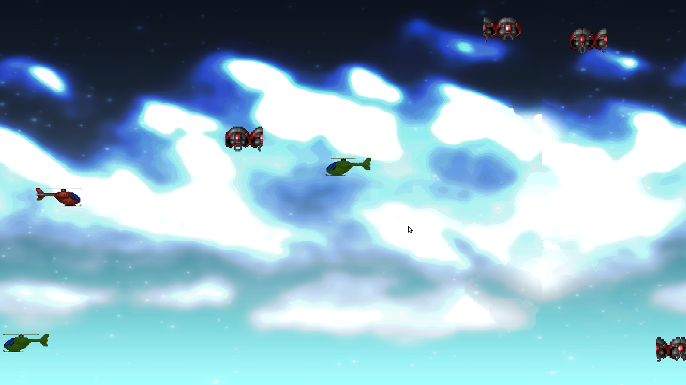

# Example Shooter - 1945

A vertically scrolling shoot-'em-up in the shape of Capcom's *1942*, built as a Storm! Engine v2 example. Demonstrates a three-state stack (menu, play, game over), high entity churn with deferred lifecycle, one-shot animations, an immediate-mode HUD, and physical game-controller input.



## Building & Running

From the `examples/shooter/` directory:

```bash
make        # build
make run    # launch
```

The binary is written to `bin/1945`.

An optional first argument selects the starting state, which is useful when
working on one screen without driving the menu each time:

```bash
./bin/1945            # menu (normal)
./bin/1945 play       # straight into the game
./bin/1945 gameover   # straight to the game-over screen
```

## How to Play

Fly up the screen, shoot the formations coming down, and roll to slip through the ones you cannot outrun.

| Keyboard | Controller | Action |
|---|---|---|
| `←` `→` `↑` `↓` | Left stick / D-pad | Move |
| `Space` | `A` or right trigger | Fire (hold) |
| `Z` | `B` or `X` | Roll — plays the 8-frame barrel roll and grants invulnerability for its duration |
| `Enter` | `A` / `Start` | Confirm on the menu and game-over screens |
| `ESC` | `Back` | Quit |

Three lives, shown top-right. Losing one resets you to the start position and shows **GET READY!** with a brief grace period. At zero lives the game-over screen appears and returns to the menu.

Keyboard and controller are merged, so either drives the game and neither disables the other. A pad plugged in before launch is picked up at startup; one plugged in later is picked up from `SDL_CONTROLLERDEVICEADDED`.

## What this example demonstrates

| Area | Where to look |
|---|---|
| **Three-state stack** | `menuState`, `playState`, `gameOverState`. `changeState` is followed immediately by `return` — the state is off the stack and its deletion is pending. |
| **Shared `AssetStore`** | `Game` owns it for the whole run and hands out a raw pointer. The scaffold's pattern of moving it into the first state would have cleared the textures the moment that state exited, leaving the next screen blank. |
| **Deferred entity lifecycle** | A killed entity stays alive, and stays in its group, until the next `registry_.Update()`. `CheckCollisions` tracks ids killed this frame in a `std::set` so a second bullet cannot score the same enemy twice. |
| **Entity churn** | Bullets, enemies and explosions are created and destroyed continuously. Component storage is a dense vector indexed by entity id, so everything is culled off-screen or on animation end; ids recycle and the pools stay flat. |
| **One-shot animations** | `AnimationComponent(n, fps, false, /*isLooped=*/false)` stops on the last frame but does **not** remove the entity. Explosions kill themselves; the roll returns the player to frame 0. |
| **Filtered contact detection** | `ContactSystem` reports overlaps instead of acting on them, which is what leaves room to score the kill and spawn the explosion. `CollisionSystem`, the older one, is deliberately not registered: it kills *both* entities on contact, which would delete the player. `SetPairFilter` rejects everything but bullet-vs-enemy and player-vs-enemy *before* the manifold is built, so a dense volley never pays for every bullet pairing with every other bullet. |
| **Immediate-mode HUD** | `ui.h`. Score, labels and centred messages are `SDL_RenderCopy` calls in `render()`, not entities — a glyph entity per frame would burn ids forever and buy nothing. |
| **Controller input** | `<stormengine2/input/gamepad.h>`. The engine's `Gamepad` - this example used to carry a local copy of it. `SDL_GameController` rather than `SDL_Joystick`, so any recognised pad maps onto the Xbox model and reports buttons by meaning. State is polled per frame, never accumulated, so a disconnect mid-hold cannot latch a direction on. |

## Assets

Artwork is from **SpriteLib**, © 1996–2017 [Ari Feldman](https://widgetworx.com/projects/sl.html)
— specifically the *1945* set from `shooter/1945.png`.

SpriteLib is distributed under the **Common Public License 1.0**. It is free to use and redistribute, but it is **not** public domain and its terms travel with the files: the full license is kept alongside the artwork in [`assets/license.rtf`](assets/license.rtf) and must stay with it. Note this differs from the rest of the repository, which is WTFPL.

The original source sheet is not usable as shipped and was prepared before use:

- Cells sit on a **33px pitch with 1px grey separators** starting at (4,4), not a clean 32px grid from the origin.
- There is **no alpha channel** — every sprite sits on opaque blue `(0,67,171)`.

`assets/gfx/sheet.png` is the result: separators removed, re-packed to a clean 32px pitch, and the background colour-keyed to transparent. The UI text is not on that grid at all, so it was cut into the discrete `assets/gfx/ui_*.png` images. [`assets/SHEET.md`](assets/SHEET.md) indexes every cell and UI file, including the digit metrics and the sprite-facing note.

`assets/gfx/icon.png` is the window icon, set with `SDL_SetWindowIcon` at
startup. It is the player fighter (sheet cell 0,0) flipped nose-up, trimmed to
the sprite's bounds and centred at 64x64. Being derived from the same artwork,
it carries the same CPL-1.0 terms.

