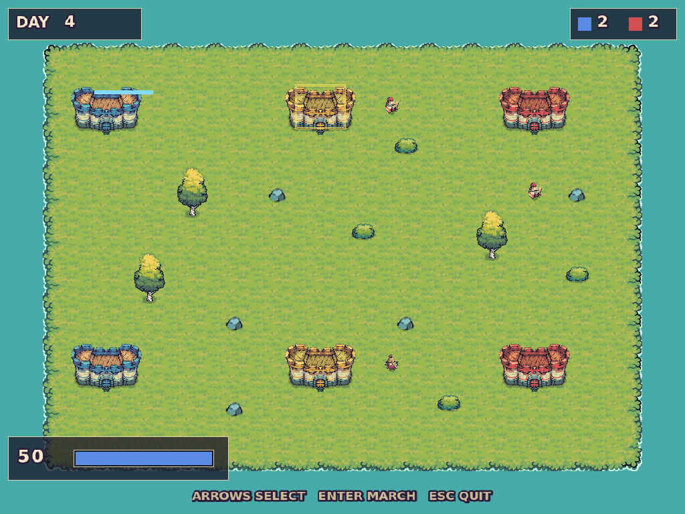

# Example Strategy - Realms

A two-layer strategy game in the shape of Sega Saturn's *Dragon Force*: a top-down campaign map where generals march between castles, and a side-on massbattle that resolves when two armies meet. Demonstrates a **pushed** state - the map stays alive underneath the battle - plus a shared campaign model, a 64px tilemap, and per-animation sprite strips.



## Artwork is not included

**This is the only example that does not run from a fresh clone.** Its sprites are [Tiny Swords](https://pixelfrog-assets.itch.io/tiny-swords) by Pixel Frog, whose licence permits use but forbids redistribution, so the pack is downloaded rather than committed. It is free.

See [`assets/README.md`](assets/README.md) for the download and the file layout. Until the art is in place the game prints the URL and exits rather than opening a black window.

## Building & Running

From the `examples/strategy/` directory:

```bash
make        # build
make run    # launch
```

The binary is written to `bin/realms`.

An optional first argument selects the starting screen, which is useful when working on one of them without driving the campaign each time:

```bash
./bin/realms             # menu (normal)
./bin/realms overworld   # straight to the campaign map
./bin/realms battle      # straight into a fight
./bin/realms gameover    # straight to the end screen
```

## How to Play

Six castles, three generals a side. Take all six.

| Keyboard | Controller | Action |
|---|---|---|
| `←` `→` | `LB` `RB`, or D-pad left/right | Cycle which of your idle generals is selected |
| `↑` `↓` | D-pad up/down, or left stick | Cycle that general's destination - a yellow ring marks it |
| `Enter` | `A` / `Start` | March |
| `1` `2` `3` `4` | `A` `B` `X` `Y` | Battle orders: charge, hold, volley, retreat |
| `Enter` / `Y` | `A` / `Start` | Confirm the retreat prompt |
| `ESC` / `N` / `4` | `B` / `Back` | Cancel the retreat prompt |
| `ESC` | `Back` | Quit, from any screen |

Any pad SDL recognises works: the game talks to `SDL_GameController` rather than `SDL_Joystick`, so a DualShock or a generic USB pad lands on the same buttons through SDL's mapping database with no special cases. A pad plugged in before launch is opened at startup; one plugged in later arrives on `SDL_CONTROLLERDEVICEADDED`.

The day counter advances on its own, so the map never sits still waiting for input. Enemy generals march on their own schedule. An army reaching an undefended enemy castle takes it outright; one that meets a defending general starts a battle.

Troops counter each other in a triangle - **warrior beats archer beats spearman beats warrior**, at 1.5x. Orders modify your own side for a few seconds: **charge** raises damage dealt and taken, **hold** lowers both, **volley** is strong but only for archers, and **retreat** concedes the castle immediately.

Retreat asks before it lands. Every other order wears off in a few seconds; that one ends the battle and hands over the castle, so it opens a confirmation and pauses the fighting until you answer. While the prompt is up nothing else responds - a stray order key cannot slip through, and `ESC` cancels the prompt instead of quitting, so `ESC` is never the key that loses a castle.

## What this example demonstrates

| Area | Where to look |
|---|---|
| **A pushed state** | `overworldState.cpp`. `pushState` runs the new state's `onEnter()` and leaves the one underneath untouched, so the map's `Registry`, entities and day counter survive the battle. `popState` then fires **`resume()`, not `onEnter()`** - which is where every post-battle change happens. No other example in this repository does this. |
| **A model above both states** | `world.h`. The battle reads which armies met and writes back who won. `Campaign` is owned by `Game`, not by the overworld, so the battle never holds a pointer into a state that may be mid-teardown. `BattleResult::pending` is a handshake, so a `resume()` from any other cause cannot re-award a castle. |
| **Only the top state draws** | `GameStateMachine::render()` renders `m_gameStates.back()` and nothing else, so the battle fully occludes the map. A translucent overlay or a picture-in-picture minimap is not possible without changing the engine. |
| **One PNG per animation** | Tiny Swords ships each animation as its own horizontal strip, which is exactly what `AnimationComponent(n, fps, /*vertical=*/false, ...)` walks. No sheet repacking and no cell-index table - compare `examples/shooter`, whose source sheet needed both. |
| **Draw-time scaling** | `RenderSystem` computes `dstRect` as `sprite.width * transform.scale.x`, so a 192x192 frame at `scale 0.55` draws at ~106px. The PNGs are never resized. |
| **One-shot animations must self-cull** | `AnimationSystem` clamps a non-looping animation to `numFrames - 1` and leaves the entity alone. Testing `currentFrame >= numFrames` therefore **never** fires; `battleState.cpp` tests `>= numFrames - 1` and kills the entity itself. Getting this wrong leaks an entity per hit for the whole battle. |
| **Popping the last state** | An empty state machine is not an exit. `Game::Run` keeps looping on `isRunning_` while `processInput`/`update`/`render` all return immediately, so nothing calls `SDL_PollEvent` - the window stops responding and the process spins at 100% CPU, unkillable by anything short of `SIGKILL`. `BattleState` checks the stack depth before popping, which matters only for `./bin/realms battle`. |
| **Deterministic scatter** | `SpawnDecorations` places scenery from a fixed-seed LCG, not `rand()`, so the map is identical on every run - decorations that wander make a visual regression impossible to spot. Keep-out radii around the castles and around the road segments (the straight lines army markers lerp along) mean moving a castle re-flows the scenery instead of leaving a tree in the courtyard. It logs how many it actually placed, which is usually fewer than asked for. |
| **A modal that is not a state** | The retreat prompt in `battleState.cpp` is a flag and an overlay, not a pushed state. `render()` draws only the top of the stack, so a modal pushed above the battle would appear over a blank screen with the fight gone - an overlay has to be drawn by the state it belongs to. Cancelling also credits back the wall-clock time the prompt was up, because the command and outcome deadlines are absolute `SDL_GetTicks` values: without it, a long deliberation silently expires the standing order and cuts the outcome banner short. |
| **Controller input** | `<stormengine2/input/gamepad.h>`. The engine's `Gamepad` - this example used to carry a local copy of it. `SDL_GameController`, so any recognised pad reports buttons by *meaning* rather than by index. State is polled once per frame and never accumulated from events, so a disconnect mid-hold cannot latch a direction on. Every binding is edge-triggered - a menu driven by held state scrolls once per frame. |
| **No collision detection at all** | Nothing here owns a collider. Battles are arithmetic on troop counts in `BattleState::ResolveTick`, and army markers lerp along fixed road segments, so neither `ContactSystem` nor the deprecated `CollisionSystem` is registered. The latter would be wrong for everything here anyway: it kills *both* entities on contact. |
| **Immediate-mode HUD** | `ui.h`. Bars are drawn as rects rather than blitted: Tiny Swords' `SmallBar_Base` is a three-slice asset with gaps inside one image, so stretching it as a single texture produces a broken bar. |

## Assets

Sprites: **Tiny Swords** by [Pixel Frog](https://pixelfrog-assets.itch.io/tiny-swords). Free for personal and commercial use; not redistributable, hence the download step. Crediting is optional under its terms - it is here because the pack carries this example.

`assets/ui/` and `assets/maps/` are generated and authored here.  `assets/gen-ui.sh` rebuilds the text and digits from DejaVu Sans; Storm! Engine v2 engine has no text rendering, so every string in the game is an image.

The same script draws `assets/ui/icon.png`, the window icon, from ImageMagick primitives.
